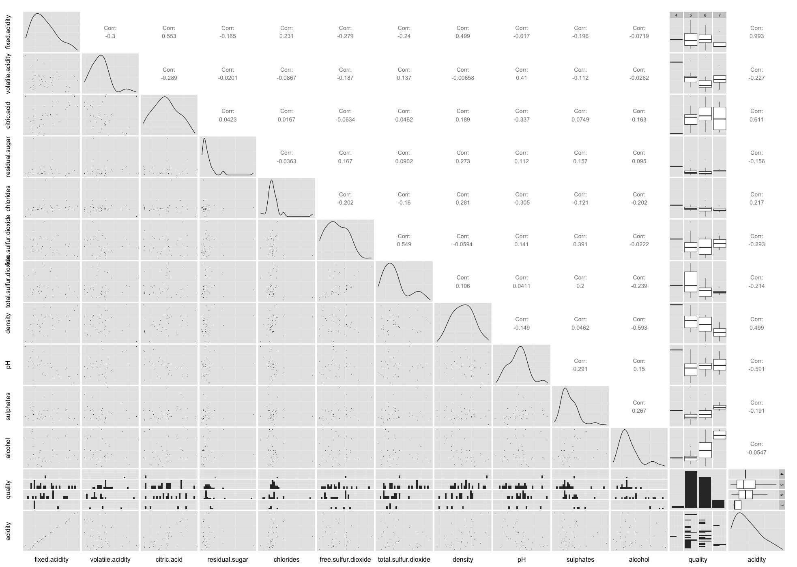

Exploring Red Wine Quality
========================================================
```{r echo=FALSE, message=FALSE, warning=FALSE, packages}
library(ggplot2)
library(dplyr)
library(GGally)
library(scales)
library(memisc)
library(reshape)
library(gridExtra)
```

```{r echo=FALSE, Load_the_Data}
# Load the Data
wq <- read.csv('data/wineQualityReds.csv')
```

## Introduction

Red wine quality is explored, observed and analyzed in this project. The underlying objective is to understand the chemical properties that influence the quality of red wines. The statistical program, R, is used for this exploratory data analysis where the dataset can be found [here](https://www.google.com/url?q=https://s3.amazonaws.com/udacity-hosted-downloads/ud651/wineQualityReds.csv&sa=D&usg=AFQjCNFDGQM6iS1viDgkVnXfjlJUymYerA) and additional literature on the variables can be found [here](https://www.google.com/url?q=https://s3.amazonaws.com/udacity-hosted-downloads/ud651/wineQualityInfo.txt&sa=D&usg=AFQjCNFCYPcMpGaIuxge2KbBPILOo5yPZA).


# Univariate Plots Section

The following are some basic statistics on the dataset and the quality variable.

```{r echo=TRUE}
# Summary Statistics
str(wq)
summary(wq)
summary(wq$quality)
```

From the 1,599 wine observations across 13 numeric variables, it should be noted that `X` appears to be the unique identifier with `quality` being the primary output. It is based on a 10-point scale and was rated by at least three wine experts. Interestingly, the wine quality ranged from 3 to 8 with an average of 5.6 and a median of 6. This indicates that the `quality` variable is ordinal and discrete. 

```{r echo=FALSE}
# Order the dataset for quality variable for easier plotting later
wq$quality <- factor(wq$quality, ordered = T)
```

```{r echo = TRUE}
table(wq$quality)
```


The following are histogram and boxplots for the 12 variables to kick off the data visualizations. 

```{r echo=FALSE, message=FALSE, Univariate_Plots, warning=FALSE}
# Histogram plots of all 12 variables
grid.arrange(qplot(wq$fixed.acidity),
             qplot(wq$volatile.acidity),
             qplot(wq$citric.acid),
             qplot(wq$residual.sugar),
             qplot(wq$chlorides),
             qplot(wq$free.sulfur.dioxide),
             qplot(wq$total.sulfur.dioxide),
             qplot(wq$density),
             qplot(wq$pH),
             qplot(wq$sulphates),
             qplot(wq$alcohol),
             qplot(wq$quality),
             ncol = 4)
```

Looking at the histograms for all the features, it can be seen that density and pH are normally distributed as well as quality. These can be interesting relationships that will be explored further in subsequent sections.

Other plots seemed to be mostly skewed to the left. Though citric acid appears to have a high number of null values that is concerning. Residual sugar and chlorides seem to have long tails. Let's see how this trends compare on boxplots next.

```{r echo=FALSE, message=FALSE, warning=FALSE}
# Reusable function for boxplots
bp <- function(feature, label) {
  return(qplot(x = label, y = feature, 
               data = wq, geom = 'boxplot', 
               xlab = '', ylab = ''))
}

# Boxplots for all 12 variables
grid.arrange(bp(wq$fixed.acidity, 'fixed acidity'), 
             bp(wq$volatile.acidity, 'volatile acidity'),
             bp(wq$citric.acid, 'citric acid'),
             bp(wq$residual.sugar, 'residual sugar'),
             bp(wq$chlorides, 'chlorides'),
             bp(wq$free.sulfur.dioxide, 'free sulphur dioxide'),
             bp(wq$total.sulfur.dioxide, 'total sulphur dioxide'),
             bp(wq$density, 'density'),
             bp(wq$pH, 'pH'),
             bp(wq$sulphates, 'sulphates'),
             bp(wq$alcohol, 'alcohol'),
             bp(wq$quality, 'quality'),
             ncol = 4)
```

These boxplots confirmed many of the trends picked up in the histogram plots. The normal distribution for density and pH can be observed here as well. Likewise, residual sugar and chlorides have a lot of outliers. The distribution of citric acid is fairly odd. Perhaps, sub-setting out the null values might help.

```{r echo=FALSE}
ggplot(aes(citric.acid), data = subset(wq, wq$citric.acid > 0)) + 
  geom_histogram()

ggplot(aes(x = "simple", y = citric.acid), 
       data = subset(wq, wq$citric.acid > 0)) + 
  geom_boxplot()
```

The histogram is slightly better, but the boxplot doesn't seem to have changed much for citric acid. This could be due to unreported or missing data.

# Univariate Analysis

### What is the structure of your dataset?

There are 1,599 wine observations across 13 numeric variables where `X` is the unique identifier and `fixed.acidity`, `volatile.acidity`, `citric.acid`, `residual.sugar`, `chlorides`, `free.sulfur.dioxide`, `total.sulfur.dioxide`, `density`, `pH`, `sulphates`, `alcohol`, `quality` are the 12 features.

The first 11 variables are physicochemical data points on wine samples and the quality is an 10-point scale output based on sensory data from at least three wine experts.

### What is/are the main feature(s) of interest in your dataset?

The main feature of interest is `quality`. From the Univariate Plots Section, it can be observed that `quality` follows a near normal distribution where the bulk of the observations are in the 5-6 range with some outliers on either end. This can further outlined by using a more pronounced variable `rating`, such that a quality score of 0-4 denotes a *Poor* wine, a score of 5-6 denotes an *Average* wine, and a score of 7+ denotes a *Good* wine.

```{r echo=FALSE, message=FALSE}
# Declare and assign values to new variable rating
wq$rating <- ifelse(wq$quality < 5, 'Poor', ifelse(wq$quality < 7, 'Average', 'Good'))

# Order ratings intuitively
wq$rating <- ordered(wq$rating, levels = c('Poor', 'Average', 'Good'))

summary(wq$rating)

ggplot(aes(rating), data = wq) + 
  geom_histogram(color = 'black', fill = 'light blue')
```

Throughout this exploratory data analysis, the drivers of `quality` will be unearthed and examined.

### What other features in the dataset do you think will help support your investigation into your feature(s) of interest?

Similar to quality, density and pH seem to be normally distributed. Fixed and volatile acidity, free and total sulphur dioxide, sulphates, and alcohol seem to be skewed and long-tailed. It is ambiguous as to what features directly affect quality, but from some [high-level research](https://en.wikipedia.org/wiki/Acids_in_wine), it appears that alcohol content, acidity and pH might be contributors to quality.

Further research failed to highlight the difference in benefit of the different types of acidity in wine. Thus, for the purpose of this project, fixed acid (tartaric acid), volatile acid (acetic acid) and citric acid were combined into a variable named, `acidity`. It should be also noted that the presence of sulphur dioxide and sulphates indicate the presence of sulphuric acid - this is ignored as being beyond the scope of this project.

```{r echo=FALSE}
wq$acidity <- wq$fixed.acidity + wq$volatile.acidity + wq$citric.acid
```

### Did you create any new variables from existing variables in the dataset?

A new variable, `rating`, was defined that categorized the wine quality ratings into *Poor*, *Average*, and *Good* buckets to illustrate its normal distribution. Lastly, a key variable, `acidity` was declared as a sum of fixed acidity, volatile acidity and citric acid. It is hypothesized that acidity is a driver of wine quality.

### Of the features you investigated, were there any unusual distributions? Did you perform any operations on the data to tidy, adjust, or change the form of the data? If so, why did you do this?

The distribution of citric acid is fairly unusual given that the distribution of fixed acidity and volatile acidity on a logarithmic scale conforms to the normal distribution of pH. It appears that citric acid has a large number of null values, which could be incomplete or unavailable data.

```{r echo=FALSE}
grid.arrange(ggplot(aes(fixed.acidity), data = wq) + 
               geom_histogram() + scale_x_log10(), 
             ggplot(aes(volatile.acidity), data = wq) + 
               geom_histogram() + scale_x_log10(), 
             ggplot(aes(citric.acid), data = wq) + 
               geom_histogram() + scale_x_log10(), 
             ncol=1)
```

The dataset in general was fairly tidy such that additional wrangling was not needed.

# Bivariate Plots Section

The bivariate plots began with a scatterplot matrix. Unfortunately, due to the large file size, generating such a plot took much too long. Instead, a sample of the dataset was used to begin the exploration. Still, the plot was just too messy to be of much use. 

```{r echo=FALSE, Bivariate_Plots, warning=FALSE, message=FALSE}
# Scatterplot matrices on a sample of the dataset for speed
#set.seed(1)
#wq_sample <- wq[,-which(names(df) %in% c('X', 'rating'))][sample(1:length(wq$quality), 40), ]
#ggpairs(wq_sample,
#        params = c(shape = I('.'), outlier.shape = I('.'))) + 
#  theme(axis.text =element_blank(),
#        axis.title = element_blank(),
#        axis.line=element_blank(),
#        axis.ticks=element_blank(),
#        panel.grid.major = element_blank())
```



The scatterplot matrix knitr chunk was almost silenced as the gigantic plot was too unwieldy to draw meaningful insights from. Nevertheless, the boxplots on `rating` and some of the correlations seem noteworthy. They were subsequently explored.

```{r echo=FALSE}
# Reusable function for boxplots
bp <- function(feature, label) {
  return(qplot(x = rating, y = feature, 
               data = wq, geom = 'boxplot', 
               xlab = label, ylab = ''))
}

grid.arrange(bp(wq$fixed.acidity, 'fixed acidity'), 
             bp(wq$volatile.acidity, 'volatile acidity'),
             bp(wq$citric.acid, 'citric acid'),
             bp(wq$acidity, 'acidity'),
             bp(wq$residual.sugar, 'residual sugar'),
             bp(wq$chlorides, 'chlorides'),
             bp(wq$free.sulfur.dioxide, 'free sulphur dioxide'),
             bp(wq$total.sulfur.dioxide, 'total sulphur dioxide'),
             bp(wq$density, 'density'),
             bp(wq$pH, 'pH'),
             bp(wq$sulphates, 'sulphates'),
             bp(wq$alcohol, 'alcohol'),
             ncol = 4)
```

These boxplots provided some very interesting insights. It appears that fixed acidity, citric acid, sulphates and alcohol are directly correlated with better wine quality, and volatile acidity and pH are indirectly correlated. The difference in behavior of the acids does bring into question the decision of having a combined `acidity` variable, but a better assessment will be made in subsequent section. 

Lastly, it seems that density doesn't play a significant part in wine quality. From it's normal distribution in the univariate section, it was a feature of interest. Perhaps the correlation values might be more kind?

```{r echo=FALSE}
# Declare empty variables for loop
corr <- NULL
corr_log <- NULL

# Loop through columns in wq dataframe and perform correlation test
for (i in names(wq)){
  corr[i] <- cor.test(as.numeric(wq[,i]), 
                      as.numeric(wq$quality))$estimate
  corr_log[i] <- cor.test(log10(as.numeric(wq[,i])), 
                          as.numeric(wq$quality))$estimate
  }

# Print out correlation values
corr
corr_log
```

Correlation tests were performed on a plain and logarithmic scale. As expected, citric acid, alcohol and, to a lesser extent, fixed acidity had a positive correlation while volatile acidity had a negative correlation to quality. Interestingly, sulphates appeared to have a stronger correlation on a logarithmic scale, and pH seemed to be hardly correlated.

A couple more interesting insights were: 
- the extremely low correlation of acidity to quality at 10.4%. This proved to be somewhat of a dead end, unfortunately.  
- density has a decent correlation of -17.5%. This isn't the best, but enough to still be of interest.

# Bivariate Analysis

### Talk about some of the relationships you observed in this part of the investigation. How did the feature(s) of interest vary with other features in the dataset?

From the boxplots, it appears that fixed acidity, citric acid, sulphates and alcohol are directly correlated with better wine quality, and volatile acidity and pH are indirectly correlated. From the correlation tests, similar trends were observed with the exception of the pH showing only about 5.7% correlation and suphates having a better correlation of 30.8%.

### Did you observe any interesting relationships between the other features (not the main feature(s) of interest)?

The acidity and sulphur dioxide relationships were examined.

```{r echo=FALSE}
grid.arrange(
  ggplot(aes(x = fixed.acidity, y = volatile.acidity), data = wq) + geom_point(),
  ggplot(aes(x = fixed.acidity, y = citric.acid), data = wq) + geom_point(),
  ggplot(aes(x = volatile.acidity, y = citric.acid), data = wq) + geom_point(),
  ncol = 1
)
```

There seems to be a trend between fixed acidity and citric acid, and volatile acidity and citric acid, but oddly there seems to be no relationship between fixed acidity and volatile acidity. This could be that the underlining chemistry are not dependent upon each other.

As a purely positive control test, the logarithmic relationship of acidity and pH were observed.

```{r echo=FALSE}
ggplot(aes(x = log10(acidity), y = pH), data = wq) + geom_point() + 
  stat_smooth(method="lm", se=FALSE)

cor.test(log10(wq$acidity), wq$pH)$estimate
```

As expected, the higher the acidity, the lower the pH value with a correlation coefficient of 70.4%.

The relationship of free and total sulphur dioxide were investigated.

```{r echo=FALSE}
ggplot(aes(x = free.sulfur.dioxide, y = total.sulfur.dioxide), data = wq) +
  geom_point() + stat_smooth(method = 'lm', se=FALSE)

cor.test(wq$free.sulfur.dioxide, wq$total.sulfur.dioxide)$estimate
```

A correlation coefficient of 66.7% indicates that there is a fairly strong relationship between the two sulphur dioxide states. Some [research](http://www.practicalwinery.com/janfeb09/page5.htm), indicates that sulphur dioxide is an antimicrobial in wine making and that free sulphur dioxide originates from the total.

### What was the strongest relationship you found?

The strongest relationship to quality were as follows:
- alcohol: 47.6%
- sulphates (log10): 30.9% 
- citric acid: 22.6%
- fixed acidity: 12.4%
- volatile acidity: -39.1%
- density: -17.5%


# Multivariate Plots Section

There were six features of interest from the bivariate plots. In this multivariate plot section, they were explored in further detail. 

```{r echo=FALSE, Multivariate_Plots}
ggplot(aes(x = alcohol, y = log10(sulphates), color = quality), data = wq) + 
  geom_point() + facet_wrap(~rating)
```

This is a really interesting plot. It appears that both alcohol and sulphates are necessary in a good wine.

```{r echo=FALSE}
ggplot(aes(x = alcohol, y = citric.acid, color = quality), 
       data = subset(wq, wq$citric.acid > 0)) + 
  geom_point() + facet_wrap(~rating)
```

Even with the null values removed, it is hard to pick out a decent trend.

```{r echo=FALSE}
ggplot(aes(x = alcohol, y = volatile.acidity, color = quality), data = wq) + 
  geom_point() + facet_wrap(~rating) + coord_flip()

ggplot(aes(x = alcohol, y = volatile.acidity, color = rating), 
       data = subset(wq, rating != 'Average')) + 
  geom_point()
```

These two plots were examined as it was believed that alcohol and volatile acidity would have an interesting interplay due to their polar correlation. The second plot proved to be very telling; it showed a clear distinction of the surface with poor wine (high volatile acidity and low alcohol content) and good wine (low volatile acidity and high alcohol content).


```{r echo=FALSE}
ggplot(aes(x = alcohol, y = density, color = quality), data = wq) + 
  geom_point() + facet_wrap(~rating) + coord_flip()
```

Density didn't appear to yield much in terms of trend with alcohol.

```{r echo=FALSE}
ggplot(aes(x = citric.acid, y = fixed.acidity, color = quality), 
       data = subset(wq, citric.acid > 0)) + 
  geom_point() + facet_wrap(~rating)

ggplot(aes(x = citric.acid, y = volatile.acidity, color = quality), data = wq) + 
  geom_point() + facet_wrap(~rating)
```

Citric acid didn't yield additional insights in visual trends with fixed acidity and volatile acidity.

```{r echo=FALSE}
ggplot(aes(x = density, y = volatile.acidity, color = quality), data = wq) + 
  geom_point() + facet_wrap(~rating) + coord_flip()
```

Density proved to be a dead end. Due to their negative correlation with wine quality, it was expected that density and volatile acidity were correlated in some way. As seen in the plot, it was not so.

```{r echo=FALSE}
ggplot(aes(x = alcohol, y = pH, color = quality), data = wq) + 
  geom_point() + facet_wrap(~rating) + coord_flip()
```

Surprisingly, pH had very little visual impact on wine quality, and was shadowed by the larger impact of alcohol.


# Multivariate Analysis

### Talk about some of the relationships you observed in this part of the investigation. Were there features that strengthened each other in terms of looking at your feature(s) of interest?

For the multivariate plots, the features that bore the strongest relationship to quality were observed by splitting the plots by quality score and faceting them by the three rating categories. It can be noted that higher alcohol, sulphates, citric acid, and fixed acidity, and lower volatile acidity leads to better wine quality. This is inline with the insights uncovered thus far.

### Were there any interesting or surprising interactions between features?

Since alcohol, specifically ethanol, is a weak acid, it was thought to be somewhat correlated with the presence of other acids, such as citric acid. The plot of alcohol against citric acid above clearly show their lack of correlation to each other.

To close off the discussion around pH, it can be visually observed to not be driver of wine quality when compared with the very obvious alcohol variable. Though, it should be noted that pH is dependent on the concentration of acids in wine, and as such doesn't seem to vary far from the 3-4 range.

------

# Final Plots and Summary

From the numerous plots above, it can be found that acidity, alcohol content and sulphates contribute to good wines. The final plots will illustrate these findings.

### Plot One: Acidity on wine quality
```{r echo=FALSE, Plot_One}
b1 <- ggplot(aes(x = quality, y = fixed.acidity, fill = rating), data = wq) + 
  geom_boxplot() + 
  xlab('Quality Score') + 
  ylab('Fixed Acidity (g/dm^3)') + 
  guides(fill=FALSE)

b2 <- ggplot(aes(x = quality, y = citric.acid, fill = rating), data = wq) +
  geom_boxplot() +
  xlab('Quality Score') + 
  ylab('Citric Acid (g/dm^3)') + 
  guides(fill=FALSE)

b3 <- ggplot(aes(x = quality, y = volatile.acidity, fill = rating), data = wq) + 
  geom_boxplot() + 
  xlab('Quality Score') + 
  ylab('Volatile Acidity (g/dm^3)') + 
  guides(fill=FALSE)

b4 <- ggplot(aes(x = quality, y = pH, fill = rating), data = wq) + 
  geom_boxplot() + 
  xlab('Quality Score') + 
  ylab('pH')

grid.arrange(b1, b2, b3, b4, ncol = 2, top='Effect of acidity and pH on wine quality ratings')
```

It can be noted that not all acids are created equal. These boxplots illustrates that higher fixed acidity (tartaric acid) and citric acid are found in better quality wines. Furthermore, the absence of volatile acidity (acetic acid) also contributed to a higher wine quality. Therefore, a lower pH alone would be a red herring for wine quality. After all, higher acid concentration will lead to a lower pH value, but only tartaric and citric acid seem to benefit wine quality.


### Plot Two: What is wine if it can't get you drunk?
```{r echo=FALSE, Plot_Two}
ggplot(aes(x = alcohol, y = volatile.acidity, color = rating), 
       data = subset(wq, rating != 'Average')) + 
  coord_cartesian(
    ylim = c(quantile(wq$volatile.acidity, 0), 
             quantile(wq$volatile.acidity, .995))
  ) + 
  geom_point() + 
  geom_vline(xintercept = mean(wq$alcohol), 
             linetype = 2, color = 'dark grey') + 
  geom_hline(yintercept = mean(wq$volatile.acidity), 
             linetype = 2, color = 'dark grey') + 
  ylab('Volatile Acidity (g/dm^3)') +
  xlab('Alcohol (% by volume)') + 
  ggtitle('Distribution of alcohol content and volatile acidity across wine qualities')
```

This scatterplot shows a trend of higher wine quality ratings with higher alcohol content and lower volatile acidity. Correlation tests performed indicated that alcohol and volatile acidity were the two most correlated features. The dotted lines represent the mean for each respective axes, whereby the bottom right quadrant has a high density of *Good* wine ratings.


### Plot Three: Putting sulphates into perspective with alcohol content
```{r echo=FALSE, Plot_Three}
wq_sub <- subset(wq, rating!= 'Average')
ggplot(aes(x = alcohol, y = sulphates), data = wq_sub) + 
  coord_cartesian(
    xlim = c(quantile(wq$alcohol, .01), quantile(wq$alcohol, .99)),
    ylim = c(quantile(wq$sulphates, .01), quantile(wq$sulphates, .99))
  ) + 
  geom_jitter(alpha = 0.5, size = 3, aes(color = rating)) + 
  scale_y_log10() + 
  geom_vline(xintercept = mean(wq$alcohol), linetype = 2, color = 'black') + 
  geom_hline(yintercept = mean(wq$sulphates), linetype = 2, color = 'black') + 
  xlab('Alcohol (% by volume)') + 
  ylab('Potassium Sulphate (log10(g/dm^3))') + 
  ggtitle('Distribution of sulphates and alcohol across wine quality ratings')
```

This final plot is perhaps one of the most telling visualization as it illustrates that good wines have an abundance of sulphates and alcohol at the same time. The dotted lines represent the mean for each respective axes, whereby the top right quadrant has a high density of *Good* wine ratings.

------

# Reflection

Exploratory data analysis proved to be very effective in understanding relationships within the red wine quality dataset. At the beginning of the analysis, various features were considered of interest, namely, density, pH, fixed acidity, volatile acidity, sulphates, and alcohol. The univariate plots were helpful in getting accustomed to the distribution of the features. But it was ultimately the bivariate plots that yielded key insights of where to examined closer. The multivariate plots revealed key trends that were extremely telling - they added a layer of detail over the bivariate plots that was very helpful and was thus favoured more so.

There were a few slight struggles and dead end throughout this project. The scatterplot matrix using ggplot was very combursome to plot. This was very likely due to dozen plus of variables that were attempted to be plotted, and as such was ineffective in illustrating trends and correlations. Instead, dedicated plots and correlation coefficient were generated against the quality feature. Beyond plotting difficulties, pH, density and the combined acidity variable proved to be dead ends. They were explored at length and with much promise, but untimately was fruitless in displaying any meaningful relationship.

It was found that fixed acidity, citric acid, alcohol content and sulphates positively drive wine quality, and volatile acidity negatively drive wine quality. Boxplots and scatterplots seemed to be the most telling visualization for this dataset. The final plots depict the relationship of acidity to a good wine, and most importantly, such a wine will likely come high alcohol content, high sulphates and low volatile acidity. The final plot also debunked the notion that pH in general was correlated to wine quality.

It should be noted that wine quality is highly subjective on a individual's taste; a better study would be the inclusion of wine quantities sold in the market. Further analysis using inferential statistics and similar methodologies should be used to verify the findings in this exploration. Nevertheless, the plots here did uncover an interesting and telling story of wine quality in the available observations.

------
# References
- [ggplot documentation](http://docs.ggplot2.org/current/index.html)
- [Log transformation](http://www.r-statistics.com/2013/05/log-transformations-for-skewed-and-wide-distributions-from-practical-data-science-with-r/)
- [Correlation test on stackoverflow](http://stackoverflow.com/questions/28577135/how-to-extract-the-p-value-and-estimate-from-cor-test-in-a-data-frame)
- [knitr output manipulation](http://yihui.name/knitr/demo/output/)
